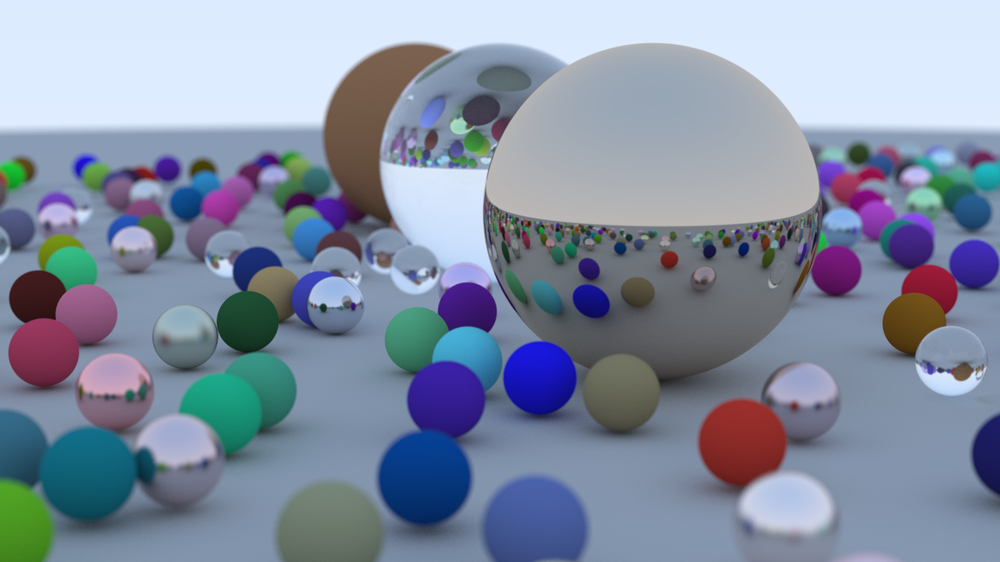

# RayTracingWeekend
This is a ray tracer, based on the online book, [_Ray Tracing in One Weekend_](https://raytracing.github.io/books/RayTracingInOneWeekend.html).
A huge thanks to Peter Shirley for writing it!
This project follows the guide fairly closely, though I have started refactoring / renaming a few pieces. I've also added LOTS of comments to supplement mathematical derivations, and add in my own interpretations/research, and alternate implementations of a few methods that I was tinkering with.

# Basic Structure
- Launch main() in Main.cpp. This loops through pixels, sampling rays.
- Most files are headers, making heavy use of inline functions to keep code optimized.
- A scene is a hittable_list, which consists of a vector hittables (which are all spheres at the moment).
- Each hittable uses a material (lambertian, metal, or dielectric)

# Usage
This project is 
Run the executable, redirecting the output into an image.ppm file:
```
> cd bin\Win32\Debug
> RayTracing.exe > image.ppm
```
To open ppm files, consider using:
- Gimp
- [This Online Viewer](https://www.cs.rhodes.edu/welshc/COMP141_F16/ppmReader.html)

# Next Steps (features to consider)
It might be a while before I get back to this project. However, it was a lot of fun, and I hope to get back to it

- Optimizations (that I've never heard of anyone else doing)
    - It seems expensive for every particle to scatter off every lambertian? This gives us ~O(pixels*samples*bounces). I have some ideas:
        - Could we smooth (in a scene-specific way), could we create connected components for each path that results in a lambertian? That way, we could aggressively smooth within each component!
            - We'd need path, not just target, because we don't want to connect an object to it's reflection
            - We'd also need a way to resolve edges that sampled multiple lambertians (but that's just a boundary definition problem that's been solved)
        - Could we profile each object, rather than doing a unique calculation for each ray? Then each pixel could have far less samples (because the function would be smooth), and we wouldn't have to worry about re-scattering off the lambertians. Instead, we could solve for a surface luminosity approximation function, after scattering a configurable number or rays, call it L.
            - If we make the approximation function a simple recording of luminosity, then I think we'd effectively be "baking" the lighting
            - However, if we make each sphere dependant on the spheres that each ray bounced from (single bounce only), then we would build a system of equations, solved in O(num_objects^2) time. This system of equations could be solved with a Kalman filter, though you'd need to describe surface profiles, rather than positions. Now that I've thought it through, O(num_objects^2) is probably actually terrible performance, given modern poly-counts. However, it would give a lambertian ray tracer that could solve in ~O(L*n_objects^2 + pixels). On top of that, you could potentially update between frames with l << L, where l would be dependant on the std_dev of the estimated change in scene position.
- General Cleanup: The guide that this project was based on was focused on simpifying concepts, but the code isn't as clean/maintainable as I'd like
    - rename some variables 
    - refactor more content out of main (scene generation)
- [Video output](https://learnopencv.com/read-write-and-display-a-video-using-opencv-cpp-python/)
- [More Responsive Output / Different Image format(s)](https://www.youtube.com/watch?v=mOSirVeP5lo&list=PLlrATfBNZ98f6Z1cDNeMLL3eXaRk1WCxK&index=10&t=575s&ab_channel=TheCherno)
    - This sample uses an output format that reloads the rendered image in real-time, as it is generated
- [Implement Triangles](https://www.scratchapixel.com/lessons/3d-basic-rendering/ray-tracing-rendering-a-triangle/why-are-triangles-useful)
    - This reference may be useful, though most of the math it already there. The new class just needs to be a hittable, with a hit() method, and possibly an update to the set_face_normal, which may be sphere specific, even though it's technically in hit_record.
- Convert to run on GPU [Here's a series to OpenGL and GPU shaders](https://www.youtube.com/watch?v=W3gAzLwfIP0&list=PLlrATfBNZ98foTJPJ_Ev03o2oq3-GGOS2&ab_channel=TheCherno)
    - OpenGL is probably too high level for this application, but this may be a good starting point for shaders
- [More advanced Ray Tracing](https://raytracing.github.io/)
- Additional Features (industry terms from a 3D modeler's perspective)
    - Consider sub-surface scattering (I haven't explored this yet, but my first thoughts obviously I'll search first but I'd guess I just take the -normal, and then either let it hit the surface
    - Specular diffuse


# [Style Guide](https://pages.nist.gov/dioptra/dev-guide/contributing-commit-styleguide.html)
